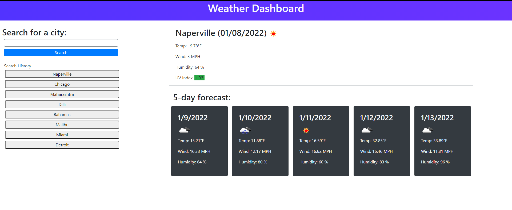

# Weather Dashboard

## Purpose
Build weather dashboard to display the current weather and 5 day weather based on city given by user

## Site Details
1. When user search for a city then he is presented with current and future conditions for that city and that city is added to the search history
2. When user sees current weather conditions for that city then he is presented with the city name, the date, an icon representation of weather conditions, the temperature, the humidity, the wind speed, and the UV index
3. When user sees the uv index then he is presented with a color that indicates whether the conditions are favorable, moderate, or severe
4. When user sees future weather conditions for that city then he is presented with a 5-day forecast that displays the date, an icon representation of weather conditions, the temperature, the wind speed, and the humidity
5. When user click on a city in the search history then he is again presented with current and future conditions for that city

The following animation demonstrates the application functionality.

Deployed Application:

## Built With
* HTML
* CSS. Frmework used - Bootstrap
* Java Script
* client side storage
* Data is coming from OpenWeather One Call API

## Website
https://rpkrupali1.github.io/wk6_weather_dashboard/

## Contribution
Made by Krupali
